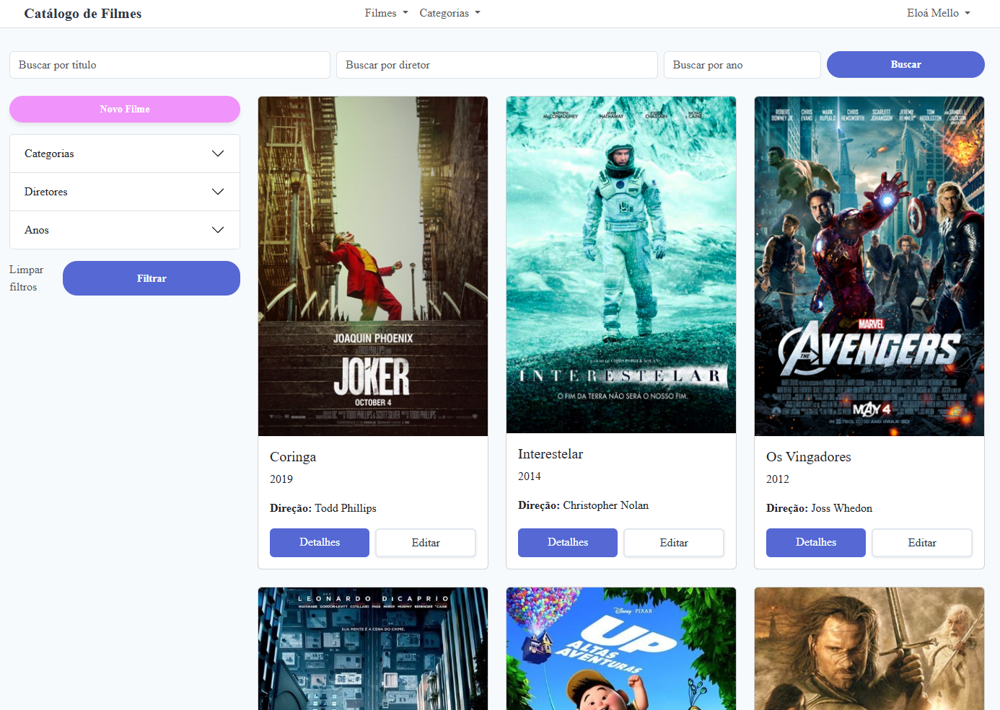
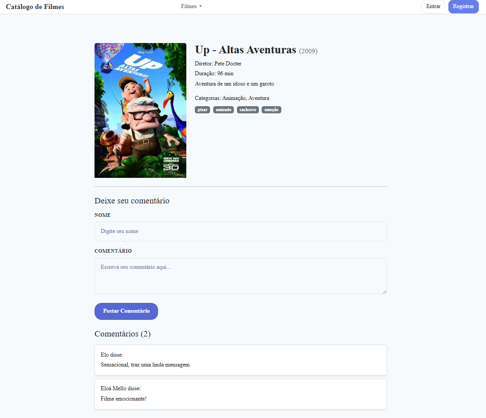

<div align="center">

  
  <h1>Catálogo de Filmes</h1>

  <p>
    Aplicação Ruby on Rails para gerenciar um catálogo de filmes, permitindo aos usuários adicionar, editar, excluir e visualizar 
    informações sobre seus filmes favoritos, com busca inteligente, categorias e tags.
  </p>

  <p>
    <a href="">
      
    </a>
  </p>
</div>

---

## Índice

- [Sobre o Projeto](#sobre-o-projeto)
- [Capturas de Tela](#capturas-de-tela)
- [Tech Stack](#tech-stack)
- [Features](#features)
- [Pré-requisitos](#pré-requisitos)
- [Instalação](#instalação)
- [Como Executar](#como-executar)
- [Executar Testes](#executar-testes)
- [Como Usar](#como-usar)
- [Contato](#contato)

---

## Sobre o Projeto

O **Catálogo de Filmes** é uma aplicação web completa desenvolvida em Ruby on Rails que permite aos usuários criar e gerenciar sua própria coleção de filmes. A aplicação oferece busca e filtro, sistema de comentários, upload de imagens e integração com IA para preenchimento automático de dados.

---

## Capturas de Tela

<div align="center"> 
  
  
</div>

---

## Tech Stack

<details>
  <summary>Backend</summary>
  <ul>
    <li><a href="https://rubyonrails.org/">Ruby on Rails 8.x</a></li>
    <li><a href="https://www.ruby-lang.org/">Ruby 3.4</a></li>
    <li><a href="https://www.postgresql.org/">PostgreSQL</a></li>
    <li><a href="https://sidekiq.org/">Sidekiq</a> - Jobs assíncronos</li>
    <li><a href="https://redis.io/">Redis</a></li>
  </ul>
</details>

<details>
  <summary>Frontend</summary>
  <ul>
    <li>HTML5, CSS3, SCSS</li>
    <li>JavaScript / <a href="https://stimulus.hotwired.dev/">Stimulus.js</a></li>
    <li><a href="https://getbootstrap.com/">Bootstrap</a></li>
    <li><a href="https://tom-select.js.org/">TomSelect.js</a> - Seleção</li>
    <li><a href="https://sweetalert2.github.io/">SweetAlert2</a> - Alertas customizados</li>
    <li><a href="https://toastify-js.com/">Toastify.js</a> - Notificações</li>
  </ul>
</details>

<details>
  <summary>Testes & Qualidade</summary>
  <ul>
    <li><a href="https://rspec.info/">RSpec</a> - Framework de testes</li>
  </ul>
</details>

---

## Features

### Gerenciamento de Filmes
- CRUD completo de filmes (Criar, Ler, Atualizar, Deletar)
- Paginação da listagem de filmes
- Visualização detalhada de filmes
- Upload de poster para os filmes com integração com Amazon S3
- Busca e preenchimento automático de dados por IA

### Organização
- Sistema de tags para os filmes
- Cadastro e gerenciamento de categorias
- Busca por título, diretor e/ou ano de lançamento
- Filtros por categoria, ano ou diretor

### Interação Social
- Sistema de comentários (anônimos e autenticados)
- Operações de usuário (login, logout, registro)
- Gerenciamento de perfil de usuário

### Recursos Técnicos
- Internacionalização (i18n)
- Testes automatizados com RSpec
- Jobs assíncronos com Sidekiq

---

## Pré-requisitos

Antes de começar, certifique-se de ter:

- **Ruby** 3.4 ou superior
- **Rails** 8.x
- **PostgreSQL** 12 ou superior
- **Redis** (para Sidekiq)
- **Bundler** (gerenciador de gems)
- **Gemini API Key** para integração com IA
  - Acesse <a href="https://aistudio.google.com/api-keys">Google AI Studio</a> para obter sua chave de API
---

## Instalação

1. **Clone o repositório:**
```bash
git clone https://github.com/eloamello/catalogo-de-filmes.git
cd catalogo-de-filmes
```

2. **Instale as dependências:**
```bash
bundle install
```

3. **Configure o banco de dados:**
```bash
rails db:create
rails db:migrate
```

4. **Configure as variáveis de ambiente:**

As credenciais são separadas por ambiente. Para o ambiente de desenvolvimento, execute:
```bash
rails credentials:edit --environment development
```
Adicione as seguintes credenciais ao arquivo aberto:
```yaml
smtp:
  user_name: seu_email@gmail.com
  password: sua_senha_app
 
gemini:
  api_key: sua_api_key_gemini
```

5. **(Opcional) Popule o banco com dados de exemplo:**
```bash
rails db:seed
```

---

## Como Executar

### Modo Desenvolvimento

1. **Inicie o servidor Rails:**

Tente executar utilizando:
```bash
bin/dev
```
Caso não funcione, abra 3 janelas do terminal, e execute os comandos abaixo em cada uma delas:
```bash
rails server
```
```bash
rails dartsass:watch
```
```bash
bundle exec sidekiq -c 2
```

---

## Executar Testes

Para rodar a suíte completa de testes:

```bash
rspec spec
```
---

## Como Usar

### Cadastrar um Filme

1. Faça login na aplicação (ou crie uma conta)
2. Clique no botão "Novo Filme"
3. Preencha as informações (título, diretor, sinopse, duracao e ano)
4. Adicione categorias e tags relacionadas (opcional)
5. Faça upload do poster do filme (opcional)
6. Clique em "Salvar"

### Buscar Filmes

- Use a barra de busca no topo da página
- Filtre por categoria, ano ou diretor usando os filtros laterais
- Combine múltiplos filtros para refinar sua busca

### Comentar em Filmes

- Acesse a página de detalhes de um filme
- Role até a seção de comentários
- Escreva seu comentário e clique em "Enviar"
- Usuários não autenticados terão que informar um nome de exibição

---

## Contato

**Eloá Mello** - [@eloamello](https://github.com/eloamello)

Link do Projeto: [https://github.com/eloamello/catalogo-de-filmes](https://github.com/eloamello/catalogo-de-filmes)

---

<div align="center">
  Feito com ❤️ por <a href="https://github.com/eloamello">Eloá Mello</a>
</div>